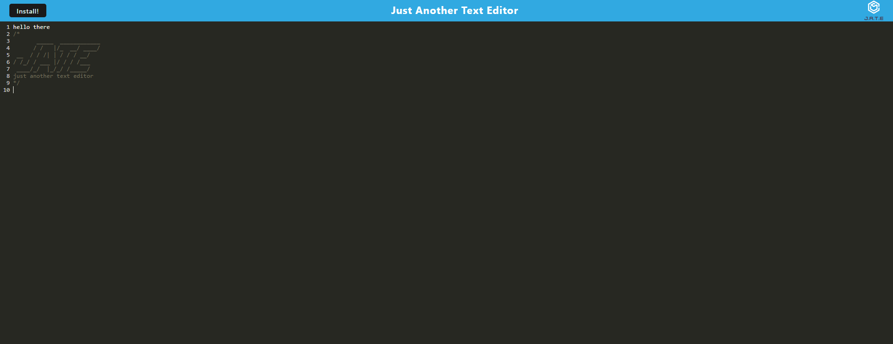

# Text Editor Progressive Web Application

## Description 
This project is a text editor web application that runs in the browser and meets the Progressive Web Application (PWA) criteria. It features data persistence techniques using IndexedDB, allowing users to create notes or code snippets with or without an internet connection.

## User Story
As a developer, I want to create notes or code snippets with or without an internet connection so that I can reliably retrieve them for later use.

## Acceptance Criteria
When opening the application in the editor, you should see a client-server folder structure.

Running npm run start from the root directory should start up the backend and serve the client.

JavaScript files should be bundled using webpack.

Running webpack plugins should generate an HTML file, service worker, and a manifest file.

The text editor should function without errors when using next-gen JavaScript.

IndexedDB should immediately create a database storage when opening the text editor.

Content entered and clicked off the DOM window should be saved with IndexedDB.

Reopening the text editor should retrieve the content from IndexedDB.

Clicking on the Install button should allow downloading the web application as an icon on the desktop.

Loading the web application should have a registered service worker using workbox.

Registering a service worker should pre-cache static assets upon loading, along with subsequent pages and static assets.

Deployment to Render should include proper build scripts for a webpack application.

## Getting Started
Clone the repository to your local machine.

Run npm install to install dependencies.

Start the application by running npm run start.

Access the application in your browser.

## Technologies Used
IndexedDB

Webpack

Next-gen JavaScript

Service Worker (Workbox)

Render Deployment

## Usage
Open the text editor in the browser.

Create and save notes or code snippets.

Close and reopen the editor to see the saved content.

Install the application for offline use.

Deploy the application to Render for production.

## License 
This project is licensed under the MIT License.

Feel free to reach out for any questions or feedback. Happy coding!
danielxstella@gmail.com

